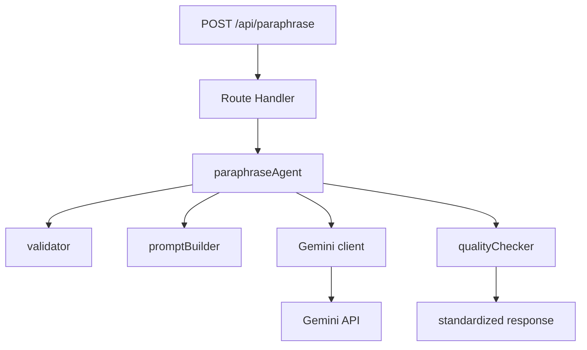

# Paraphrase Agent

Paraphrase Agent is a Next.js 15 + TypeScript application that exposes a modular AI paraphrasing backend through a single Route Handler. The current architecture is intentionally split into small, testable layers so the prompt logic, validation, Gemini integration, and quality checks stay isolated.

## Architecture

The backend is organized around a pure orchestration flow:



### Layers

- `src/app/api/paraphrase/route.ts`
  - Next.js Route Handler for `POST /api/paraphrase`
  - Reads JSON, calls the agent, and maps standardized results to HTTP responses
- `src/agents/paraphraseAgent.ts`
  - Orchestrates the full paraphrase flow
  - Validates input, builds the prompt, calls Gemini, runs quality checks, and returns a standardized response
- `src/agents/validator.ts`
  - Validates the prompt and its min/max length
- `src/agents/promptBuilder.ts`
  - Builds optimized Gemini prompts
  - Preserves citations and technical terms
- `src/lib/gemini.ts`
  - Reusable Gemini client wrapper
  - Reads `GEMINI_API_KEY` from `.env.local`
- `src/agents/qualityChecker.ts`
  - Checks generated output for basic quality constraints
- `src/types/api.ts`
  - Shared request and response types

## API

### `POST /api/paraphrase`

Paraphrases text using Gemini.

#### Request

Send JSON with the following shape:

```json
{
  "prompt": "Original text to paraphrase. Tolong parafrase menjadi bahasa akademik."
}
```

#### Response

On success, the API returns the standardized paraphrase payload:

```json
{
  "success": true,
  "data": {
    "text": "Rewritten text from Gemini."
  },
  "validation": {
    "valid": true,
    "value": {
      "prompt": "Original text to paraphrase. Tolong parafrase menjadi bahasa akademik."
    },
    "errors": []
  },
  "quality": {
    "passed": true,
    "issues": []
  }
}
```

#### Error responses

The route returns standardized errors with HTTP status codes mapped as follows:

- `400` - validation error or invalid JSON body
- `422` - quality check failure
- `502` - Gemini client or model error
- `500` - unexpected error

Example validation failure:

```json
{
  "success": false,
  "error": {
    "code": "validation_error",
    "message": "Input validation failed.",
    "details": [
      {
        "field": "prompt",
        "code": "required",
        "message": "Prompt is required."
      }
    ]
  }
}
```

## Request Rules

The input prompt must satisfy all of the following:

- `prompt` is required
- `prompt` must be within the configured minimum and maximum length

The prompt builder also preserves:

- citations
- URLs
- reference markers
- technical terms such as APIs, libraries, identifiers, acronyms, version numbers, and file paths

## Installation

### Prerequisites

- Node.js 20+ recommended
- npm
- A valid Gemini API key

### Setup

1. Install dependencies:

```bash
npm install
```

2. Create `.env.local` in the project root:

```env
GEMINI_API_KEY=your_gemini_api_key_here
GEMINI_MODEL=gemini-2.5-flash
```

3. Start the development server:

```bash
npm run dev
```

4. Open the app in your browser:

```text
http://localhost:3000
```

### Scripts

- `npm run dev` - start the development server
- `npm run build` - build the application
- `npm run start` - start the production server
- `npm run lint` - run ESLint

## Notes

- The Gemini client is created through `src/lib/gemini.ts` and will throw a clear configuration error if `GEMINI_API_KEY` is missing.
- The API layer does not contain business logic; it only handles HTTP input and output.
- The orchestration logic stays inside `src/agents/paraphraseAgent.ts` so it can be reused outside the route handler later.
